# 🚀 NeoFlow - Decentralized Crowdfunding Platform

<div align="center">
  
  
  
  
  
</div>

## 🌟 Features

### 🏆 **Core Platform**
- **Campaign Creation & Management** - Create and manage fundraising campaigns
- **Secure Wallet Integration** - Connect with MetaMask and other Web3 wallets
- **Real-time Campaign Tracking** - Live updates on funding progress
- **Smart Contract Integration** - Secure and transparent blockchain transactions

### 🎯 **NeoFlow Exclusive Features**
- **🏅 Leaderboard System** - Track top donators and fundraisers
- **🎁 NeoPoints Rewards** - Earn points for donations and activities
- **🛍️ Redemption Store** - Redeem points for exclusive merchandise
- **📊 Advanced Analytics** - Beautiful charts and activity tracking
- **🏆 Tier System** - Bronze, Silver, Gold, and Platinum tiers

### 💡 **User Experience**
- **📱 Responsive Design** - Perfect on desktop, tablet, and mobile
- **🎨 Modern UI/UX** - Clean, intuitive interface with smooth animations
- **⚡ Fast Performance** - Optimized for speed and efficiency
- **🔐 Secure & Transparent** - Blockchain-powered security

## 🛠️ Tech Stack

### **Frontend**
- **Next.js 13.2.4** - React framework with SSR and optimization
- **React 18.2.0** - Modern React with hooks and concurrent features
- **Tailwind CSS** - Utility-first CSS framework for styling
- **Wagmi 1.4.13** - React hooks for Ethereum wallet integration

### **Web3 Integration**
- **Ethers.js 5.7.2** - Ethereum library for blockchain interactions
- **RainbowKit** - Beautiful wallet connection components
- **Hardhat** - Ethereum development environment
- **Polygon Network** - Fast, low-cost blockchain transactions

### **Smart Contracts**
- **Solidity 0.8.19** - Smart contract programming language
- **OpenZeppelin** - Secure, audited smart contract libraries
- **Hardhat Toolbox** - Complete development toolkit

## 🚀 Quick Start

### Prerequisites
- Node.js 16.0 or later
- npm or yarn package manager
- MetaMask or compatible Web3 wallet

### Installation

1. **Clone the repository**
```bash
git clone https://github.com/AnandN2003/Neo-Flow.git
cd Neo-Flow
```

2. **Install dependencies**
```bash
npm install
```

3. **Start development server**
```bash
npm run dev
```

4. **Open in browser**
```
http://localhost:3000
```

## 🌐 Deployment

### Frontend Deployment (Vercel)
The frontend is optimized for Vercel deployment:

```bash
# Build the project
npm run build

# Deploy to Vercel
vercel
```

### Smart Contract Deployment
For contract deployment, see `/web3` directory:

```bash
cd web3
npm install
npx hardhat compile
npx hardhat run scripts/deploy.js --network [network]
```

## 📁 Project Structure

```
Neo-Flow/
├── components/           # React components
│   ├── Campaign/        # Campaign-related components
│   ├── common/          # Shared components
│   ├── Dashboard/       # Dashboard components
│   └── Layout/          # Layout components
├── pages/               # Next.js pages
│   ├── dashboard.js     # User dashboard with analytics
│   ├── leaderboard.js   # Community leaderboard
│   ├── rewards.js       # NeoPoints rewards system
│   └── redeem.js        # Merchandise redemption
├── utils/               # Utility functions
│   ├── helpers.js       # General helpers
│   └── rewards.js       # NeoPoints system
├── web3/                # Smart contracts
│   ├── contracts/       # Solidity contracts
│   ├── scripts/         # Deployment scripts
│   └── hardhat.config.js
└── config/              # Configuration files
```

## 🎨 Key Features Showcase

### 🏆 Leaderboard System
Track and celebrate top contributors with:
- **Top Donators** - Users who contribute the most
- **Top Fundraisers** - Creators with highest raised amounts
- **Real-time Updates** - Live leaderboard updates
- **Community Recognition** - Public acknowledgment

### 🎁 NeoPoints Rewards
Gamified donation experience:
- **100 points per 0.01 ETH** donated
- **500 bonus points** for first donation
- **2x multiplier** for donations ≥ 1 ETH
- **Tier progression** system

### 🛍️ Redemption Store
Exclusive merchandise with 12 products across 4 categories:
- **👕 Apparel** - T-shirts, hoodies, caps
- **💼 Accessories** - Bags, bottles, stickers
- **💻 Digital** - NFTs, premium features
- **🌟 Special** - Limited edition items

### 📊 Advanced Dashboard
Comprehensive analytics including:
- **Funding trends** charts
- **Category distribution** visualization
- **Recent activity** feed
- **Quick actions** panel

## 🔗 Live Demo

- **Frontend**: [Coming Soon - Will be deployed on Vercel]
- **Testnet Version**: Available on Polygon Mumbai testnet

## 🤝 Contributing

We welcome contributions! Please see our contributing guidelines:

1. Fork the repository
2. Create a feature branch
3. Make your changes
4. Submit a pull request

## 📝 License

This project is licensed under the MIT License - see the [LICENSE](LICENSE) file for details.

## 👨‍💻 Developer

**Anand N**
- GitHub : [@AnandN2003](https://github.com/AnandN2003)
- Project: [Neo-Flow](https://github.com/AnandN2003/Neo-Flow)

## 🙏 Acknowledgments

- Built with ❤️ using Next.js and Web3 technologies
- Inspired by the need for transparent, decentralized fundraising

# 🏗️ Neo-Flow DApp Architecture Flow Diagrams

## Overview

Neo-Flow is a decentralized crowdfunding platform built on Ethereum/Polygon blockchain using Next.js frontend and Solidity smart contracts. This document visualizes the complete system flow through interactive diagrams.

## 🔄 Complete System Flow Diagram

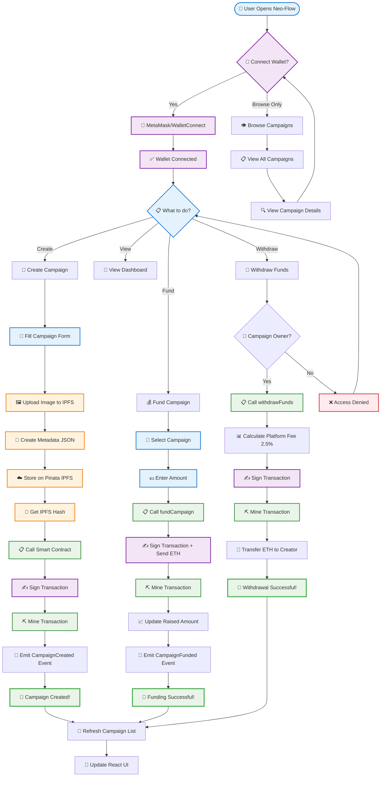

## 🔄 Technical Data Flow Architecture

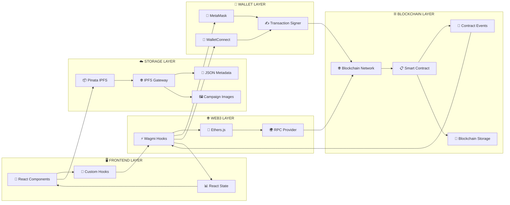

## 📱 User Journey Flow

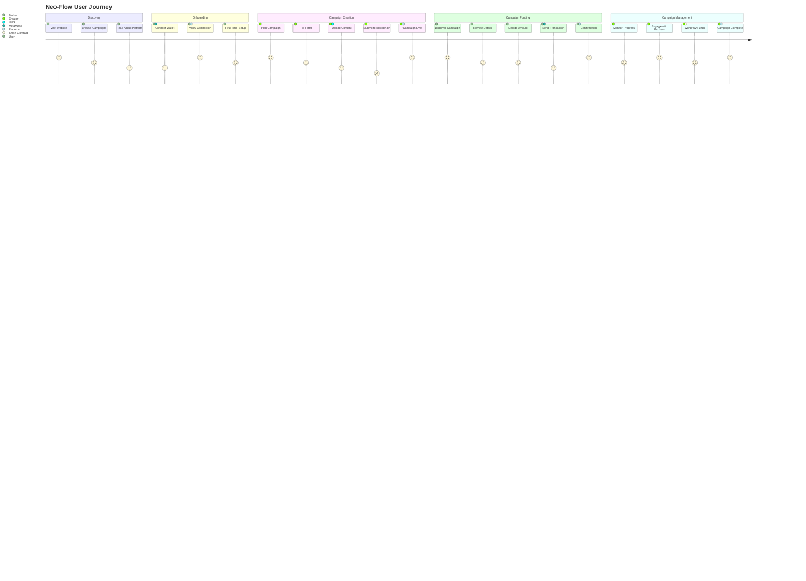

## 🔧 Smart Contract Function Flow

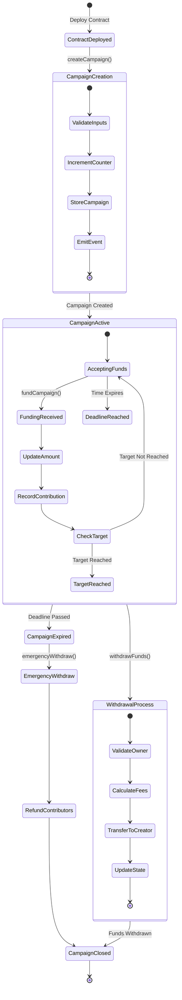

## 🔐 Security & Access Control Flow

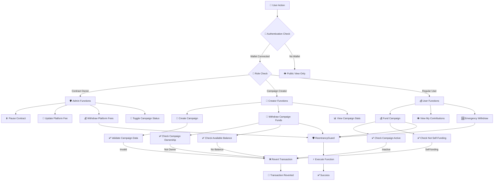

## 💾 Data Storage Architecture

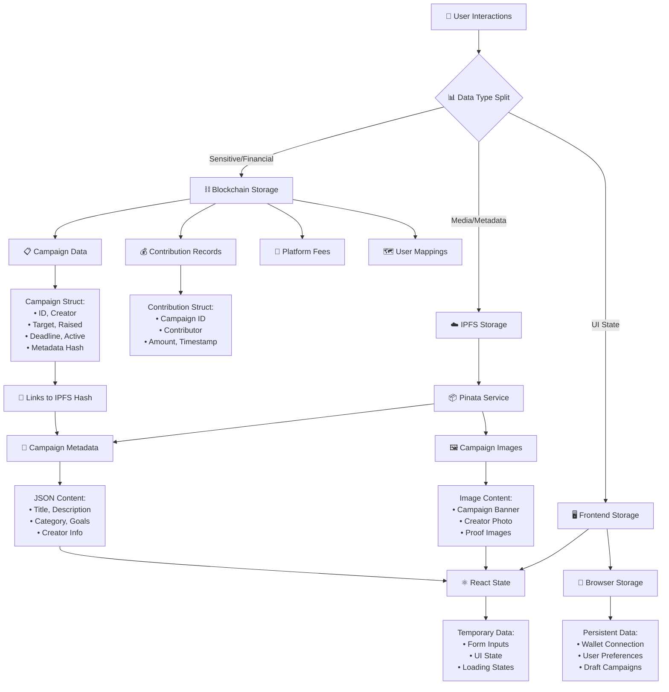

## 🌐 Network & Deployment Flow

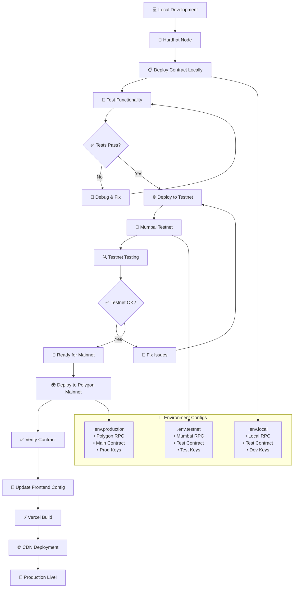

## 📁 Project Structure

```
Neo-Flow/
├── 📱 Frontend Application
│   ├── components/               # React UI components
│   │   ├── Campaign/            # Campaign-related components
│   │   │   ├── CampaignCard.js
│   │   │   ├── CreateCampaignForm.js
│   │   │   └── CampaignDetails.js
│   │   ├── Dashboard/           # Dashboard components
│   │   │   ├── DashboardStats.js
│   │   │   └── StatsCard.js
│   │   ├── Layout/              # Layout components
│   │   │   ├── Header.js
│   │   │   ├── Footer.js
│   │   │   ├── Sidebar.js
│   │   │   └── GlobalErrorBoundary.js
│   │   └── common/              # Shared components
│   │       ├── Loading.js
│   │       ├── LoadingAnimation.js
│   │       └── NeoPointsToast.js
│   ├── pages/                   # Next.js pages
│   │   ├── _app.js             # Global app configuration
│   │   ├── index.js            # Landing page
│   │   ├── dashboard.js        # User dashboard
│   │   ├── create-campaign.js  # Campaign creation
│   │   ├── my-campaigns.js     # User's campaigns
│   │   └── contributions.js    # User's donations
│   ├── hooks/                   # Custom React hooks
│   │   ├── useContract.js      # Main contract interaction
│   │   ├── useCampaignDetails.js
│   │   └── useSSRSafeDate.js
│   ├── utils/                   # Utility functions
│   │   ├── ipfs.js             # IPFS operations
│   │   ├── helpers.js          # General utilities
│   │   └── rewards.js          # NeoPoints system
│   ├── constants/               # Configuration constants
│   │   ├── abi.js              # Smart contract ABI
│   │   └── index.js            # Platform constants
│   ├── config/                  # Configuration files
│   │   └── wagmi.js            # Web3 configuration
│   └── styles/                  # CSS styles
│       └── globals.css         # Global styles
│
├── ⛓️ Blockchain Infrastructure
│   └── web3/                    # Smart contract development
│       ├── contracts/           # Solidity contracts
│       │   └── CrowdfundingMarketplace.sol
│       ├── scripts/             # Deployment scripts
│       │   └── deploy.js
│       ├── hardhat.config.js    # Hardhat configuration
│       └── package.json         # Blockchain dependencies
│
├── 📝 Documentation
│   ├── README.md               # Project overview
│   ├── Architecture.md         # This file
│   ├── DEPLOYMENT_GUIDE.md     # Deployment instructions
│   └── docs/                   # Additional documentation
│
└── ⚙️ Configuration Files
    ├── package.json            # Frontend dependencies
    ├── next.config.js          # Next.js configuration
    ├── tailwind.config.js      # Tailwind CSS config
    ├── .env.local              # Environment variables
    └── vercel.json             # Vercel deployment config
```

## 🔄 Data Flow Architecture

### Campaign Creation Flow

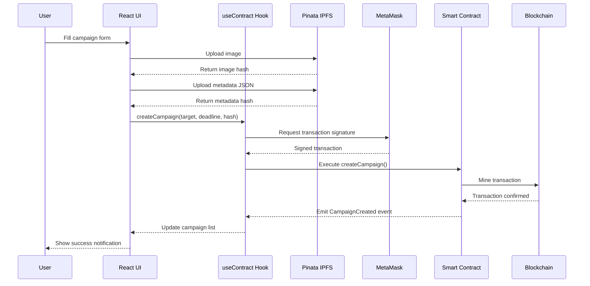

### Campaign Funding Flow

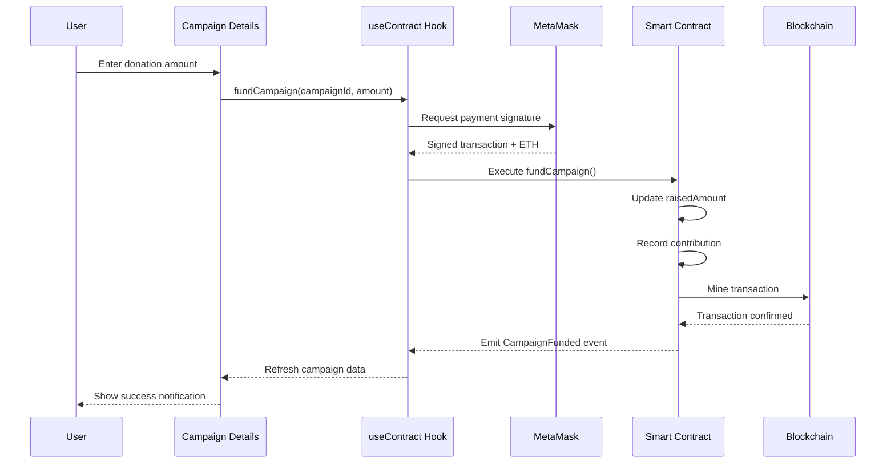

## 🔧 Technical Stack

### Frontend Technologies
```
🎨 Frontend Stack
├── ⚛️ React 18.2.0                 # UI framework
├── ⚡ Next.js 13.2.4              # React framework with SSR
├── 🎨 Tailwind CSS                # Utility-first CSS
├── 🔥 React Hot Toast             # Notifications
├── 📊 React Icons                 # Icon library
└── 🎭 GSAP                        # Animations
```

### Web3 Technologies
```
🌐 Web3 Stack
├── ⚡ Wagmi 1.4.13               # React hooks for Ethereum
├── 🌈 RainbowKit 1.3.6          # Wallet connection UI
├── 📡 Ethers.js 5.7.2            # Ethereum library
├── 🔗 Viem 1.21.4                # TypeScript Ethereum library
└── 🌐 Web3Modal 1.9.12           # Multi-wallet support
```

### Blockchain Infrastructure
```
⛓️ Blockchain Stack
├── 🔨 Hardhat 2.13.0             # Development environment
├── 📋 Solidity 0.8.19            # Smart contract language
├── 🛡️ OpenZeppelin Contracts     # Security libraries
├── 🟣 Polygon Network             # L2 scaling solution
└── 🧪 Mumbai Testnet              # Testing environment
```

### Storage & Services
```
💾 Storage & Services
├── 📦 Pinata Cloud               # IPFS pinning service
├── 🌐 IPFS                       # Decentralized storage
├── 🚀 Vercel                     # Frontend deployment
└── 🔧 GitHub                     # Code repository
```

## 🔒 Security Architecture

### Smart Contract Security

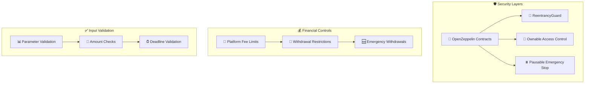

### Security Features

1. **ReentrancyGuard**: Prevents reentrancy attacks on payable functions
2. **Ownable**: Access control for administrative functions
3. **Pausable**: Emergency stop mechanism for the entire contract
4. **Input Validation**: Comprehensive validation of all inputs
5. **Financial Controls**: Platform fee limits and withdrawal restrictions
6. **Emergency Features**: Contributor protection mechanisms

## 🌊 Data Flow Patterns

### Real-time Data Synchronization

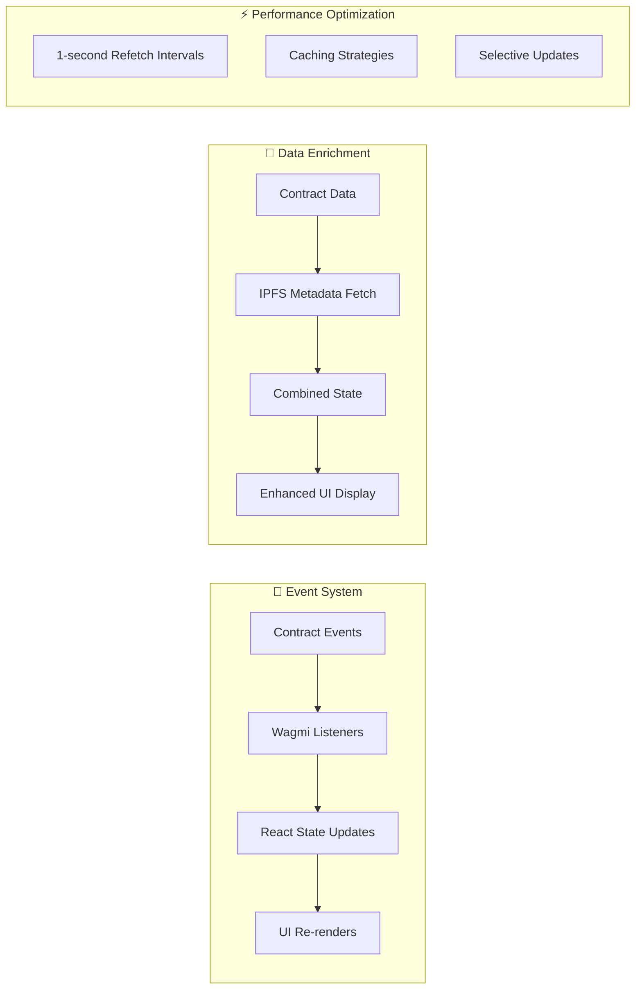

### State Management Flow

1. **Contract Events**: Smart contract emits events for all state changes
2. **Wagmi Hooks**: Automatically listen for events and refetch data
3. **React State**: Component state updates trigger UI re-renders
4. **IPFS Integration**: Metadata fetched and cached for enhanced display
5. **Performance**: Optimized refetch intervals and caching strategies

## 🚀 Deployment Architecture

### Development Environment

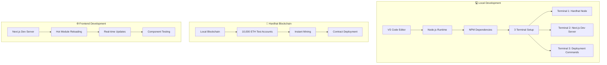

### Production Deployment

```mermaid
graph TB
    subgraph "🚀 Frontend Deployment (Vercel)"
        A[GitHub Repository] --> B[Vercel CI/CD]
        B --> C[Build Process]
        C --> D[Static Site Generation]
        D --> E[Global CDN Distribution]
    end
    
    subgraph "⛓️ Blockchain Deployment"
        F[Smart Contract] --> G[Network Selection]
        G --> H[Mumbai Testnet / Polygon Mainnet]
        H --> I[Contract Verification]
        I --> J[ABI Generation]
    end
    
    subgraph "🔧 Configuration Management"
        K[Environment Variables] --> L[Network RPC URLs]
        L --> M[Contract Addresses]
        M --> N[IPFS API Keys]
    end
```

## 📊 Platform Economics

### Fee Structure

```
💰 Platform Economics
├── Platform Fee: 2.5% (250 basis points)
├── Fee Collection: On fund withdrawal
├── Fee Destination: Contract owner wallet
├── Maximum Fee: 10% (safety limit)
└── Fee Adjustment: Owner-only function
```

### Revenue Streams

1. **Platform Fees**: 2.5% of all successfully withdrawn funds
2. **Potential Premium Features**: Advanced analytics, promoted campaigns
3. **NFT Integration**: Special campaign rewards and certificates

## 🎯 Key Features

### Core Platform Features

- ✅ **Campaign Creation & Management**
- ✅ **Secure Wallet Integration**
- ✅ **Real-time Progress Tracking**
- ✅ **Smart Contract Security**
- ✅ **IPFS Decentralized Storage**
- ✅ **Multi-chain Support**
- ✅ **Mobile Responsive Design**

### NeoFlow Exclusive Features

- 🏆 **Leaderboard System**
- 🎁 **NeoPoints Rewards**
- 🛍️ **Redemption Store**
- 📊 **Advanced Analytics**
- 🏅 **Tier System**
- 📱 **Mobile App Support**

## 🔮 Future Roadmap

### Planned Enhancements

1. **Multi-chain Expansion**: Ethereum, BSC, Avalanche support
2. **NFT Integration**: Campaign completion certificates
3. **DAO Governance**: Community-driven platform decisions
4. **Advanced Analytics**: AI-powered success predictions
5. **Social Features**: Campaign sharing and networking
6. **Mobile App**: Native iOS and Android applications

### Technical Improvements

1. **GraphQL Integration**: Enhanced data querying
2. **Serverless Functions**: Backend API development
3. **Push Notifications**: Real-time campaign updates
4. **Advanced Caching**: Improved performance optimization
5. **Testing Suite**: Comprehensive automated testing

## 📞 Support & Documentation

### Development Resources

- 📚 **Smart Contract Documentation**: Inline comments and NatSpec
- 🎥 **Video Tutorials**: Step-by-step setup guides
- 📖 **API Documentation**: Frontend hook usage examples
- 🔧 **Deployment Guides**: Multiple environment setups
- 🐛 **Troubleshooting**: Common issues and solutions

### Community & Support

- 💬 **Discord Community**: Developer discussions
- 📧 **Email Support**: Technical assistance
- 🐙 **GitHub Issues**: Bug reports and feature requests
- 📝 **Documentation Wiki**: Comprehensive guides
- 🎓 **Developer Workshops**: Regular training sessions

---

**Built with ❤️ by Anand N**  
**GitHub**: [@AnandN2003](https://github.com/AnandN2003)  
**Project**: [Neo-Flow](https://github.com/AnandN2003/Neo-Flow)


---

<div align="center">
  <strong>🚀 Ready to revolutionize crowdfunding? Start your campaign today! 🚀</strong>
</div>
